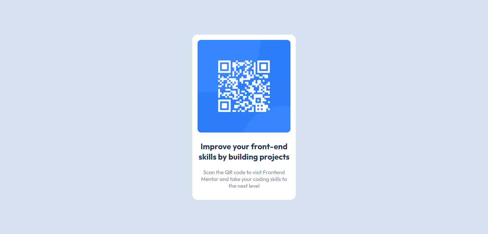

# Frontend Mentor - QR code component solution

This is a solution to the [QR code component challenge on Frontend Mentor](https://www.frontendmentor.io/challenges/qr-code-component-iux_sIO_H). Frontend Mentor challenges help you improve your coding skills by building realistic projects. 

## Table of contents

- [Overview](#overview)
  - [Screenshot](#screenshot)
  - [Links](#links)
- [My process](#my-process)
  - [Built with](#built-with)
  - [What I learned](#what-i-learned)
  - [Continued development](#continued-development)
  - [Useful resources](#useful-resources)
- [Author](#author)
- [Acknowledgments](#acknowledgments)


## Overview

This is a solution to the [QR code component challenge on Frontend Mentor]

### Screenshot



### Links

- Solution URL: (https://github.com/assem-frontdev/Qr-code)
- Live Site URL: (https://app.netlify.com/sites/qrcode-frontendmentor/settings/domain)

## My process

- I struggle a bit when trying to center the box both horizontally and vertically but after doing a bit of research
 I found that flexbox can be one of the easiest and most modern ways to center elements.

### Built with

- Semantic HTML5 markup
- CSS custom properties
- Flexbox

### What I learned

I learned how to make a good search when I struggle to find how to center elements in the easiest way.
Also, be patient when the design doesn't look like the original design. 

To see how you can add code snippets, see below:

```html
<section class="container"><section class="box"></section></section>
```
```css
.container {
  height: 100vh;
}
```


### Continued development

I will ensure to continue working on most the free newbie challenges.


### Useful resources

- [Example resource 1](https://www.freecodecamp.org) - This helped me how to center elements in many ways.
- [Example resource 2](https://www.stackoverflow.com) - This is an amazing site to find quickly what you're looking for.

## Author

- Frontend Mentor - [@assem-frontdev](https://www.frontendmentor.io/profile/assem-frontdev)


## Acknowledgments

- Many thanks for frontendmentor to providing us with these kinds of challenges to improve our skills.